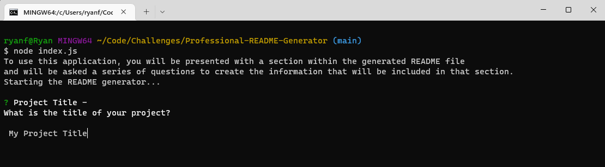

# Professional README Generator

## Description
The motivation for this project was to explore the inquirer node module and to be able to use the command line to prompt and obtain user data. This project was created as a tool to reduce the time it takes to create a project README file so that the developer may spend more time working on the project itself. Through creating this project I learned how chain promises using inquirer, parse through user data received from inquirer, and how to use the fs module for creating new files.

## Table of Contents

- [Installation](#installation)
- [Usage](#usage)
- [License](#license)
- [Contributing](contributing)
- [Tests](#tests)
- [Questions](#questions)

## Installation

To install the project dependencies, run 'npm i' while in the project root directory.

## Usage

To use this application and start the README generator, use the command 'node index.js' while in the project root directory. Once started, the user will be prompted to answer questions about their project, beginning with the project title.

Inquirer will guide the user to complete each section. When completing the Usage section, the user is able to include screenshots to give readers further guidance. The inquirer prompt at this step only asks for the screenshot's file name. The user must manually place the screenshot file into the '/assets/images' folder for the README to access the image.

When finished answering all of the questions, the user is presented with a confirmation message in the command line that the generator is complete and that they can find the generator README in the 'output' folder.

Below is an example of a README generated through the application.

## License

N/A

## Contributing

N/A

## Tests

N/A

## Questions

If you have any questions about the repo, open an issue or contact me directly at ryanfernandez11@gmail.com. You can find more of my work at [my GitHub page](https://github.com/ryanafernandez/).
